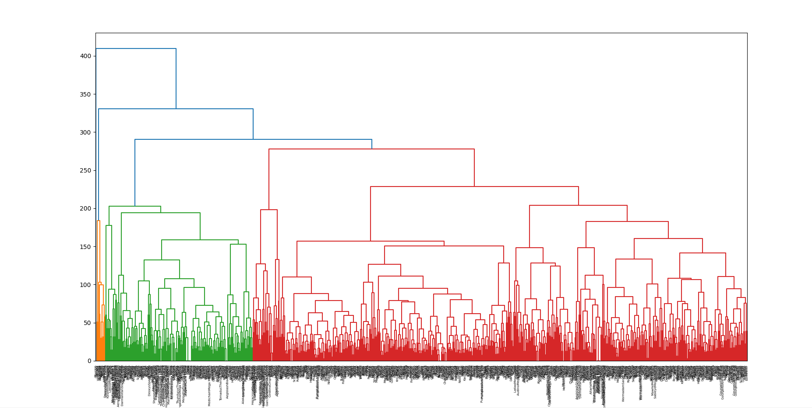

### Pokémon Clustering

Takes a database of over 800 Pokémon and implements hierarchical agglomerative clustering that groups each Pokémon into clusters based on its overall stats/distance.

*Screenshot of HAC using all 800 entries*